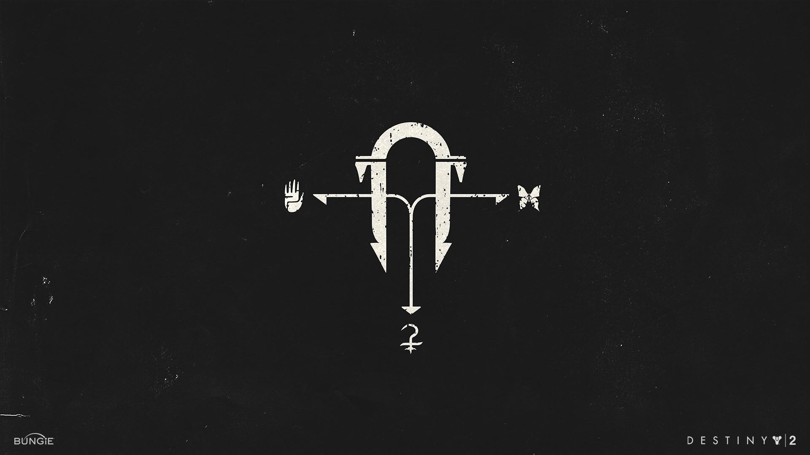

# Niobe Labs

Niobe Labs is a developer project by Alexander Carr and Griffin Schenker.  The repositories and work completed within this organization are for personal use only.  If you are interested in any of our work feel free to reach out!

 

---

 

  

    
  

  

    
<b>Alexander Carr</b>

    
<a href=https://jalexandercarr.github.io>Website</a>

    
<a href=https://www.linkedin.com/in/jalexandercarr>LinkedIn</a>

  

 

  

    
  

  

    
<b>Griffin Schenker</b>

    
<a href=https://gsschenker.github.io>Website</a>

    
<a href=https://www.linkedin.com/in/griffin-schenker>LinkedIn</a>

  

